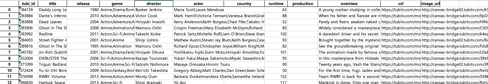
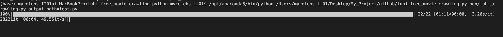

# tubi-free-movie-crawling-python

Crawls list of free streaming movies from [tubi site](https://tubitv.com/) using selenium and Beautifulsoup and creates excel file.

> To extract movies only, had to leave out some genres that contained tv series mostly. Below are genres that were removed intentionally.

> ['sports_movies_and_tv', 'crime_tv', 'docuseries', 'foreign_language_tv', 'kids_shows', 'para_los_nios_y_familias', 'preschool', 'reality_tv', 'telenovelas_y_series', 'tv_comedies', 'tv_dramas', 'lifestyle_tv']

&nbsp;
&nbsp;
&nbsp;

# Requirements
You may find requirements in requirements.txt which can be installed using pip install -r requirements.txt

**More info:**

> Python

python should be installed in your computer. here is the official website: http://www.python.org

&nbsp;

> BeautifulSoup

A html parser to extract search results from Google. BeautifulSoup(version 4) is better.

For more information about BeautifuleSoup, please visit: http://www.crummy.com/software/BeautifulSoup/

&nbsp;

> pandas

pandas is a fast, powerful, flexible and easy to use open source data analysis and manipulation tool, built on top of the Python programming language.

For more information about pandas, please visit: https://pandas.pydata.org/

&nbsp;

> selenium

Selenium Python bindings provides a simple API to write functional/acceptance tests using Selenium WebDriver. 

For more information about selenium, please visit : https://selenium-python.readthedocs.io/

&nbsp;

To use selenium, chromedriver needs to be installed as well. Please download chromedriver at site below. Need to check your chrome version before downloads.

https://chromedriver.chromium.org/downloads

&nbsp;
&nbsp;
&nbsp;

# Extracted data
Below is screenshot of excel file created by code.

Below shows elements cralwed from tubitv. **country** and **production** information were not crawled because they were not provided.

{   
    "tubi_id" : 184139,
    
    "title" : Daddy Long Legs, 
    
    "release" : 1980, 
    
    "genre" : Anime,Drama,Romance, 
    
    "director" : Bunker Jenkins, 
    
    "actor" : Maria Scott,Laura Mendoza, 
    
    "country" : None
    
    "runtime" : 63

    "production" : None

    "overview" : A young orphan studying in college to be a novelist, has to keep in touch with her benefactor, who pays for her tuition, by writing to him frequently, about her life and progress. There comes a time when Judy has to make a decision about two romances which occur as she becomes of age. Rare classic family movie from the late 1970's.

    "url" : https://tubitv.com/movies/184139/daddy_long_legs, 

    "image_url" : http://canvas-bridge02.tubitv.com/63XbKHhoQOwK4LQsPHMDasu8GL8=/400x574/smart/img.adrise.tv/bf3f4557-25e4-4a90-8dbb-518c58e5ddbf.png
}

&nbsp;
&nbsp;
&nbsp;

# How to use
run tubi_crawler file with python

**output_path should always be in xlsx form or error will occur**
~~~
python tubi_crawling.py tubi.xlsx
~~~

Then it will crawl from tubi site and create excel folder at the specified path like below.

&nbsp;
&nbsp;
&nbsp;
